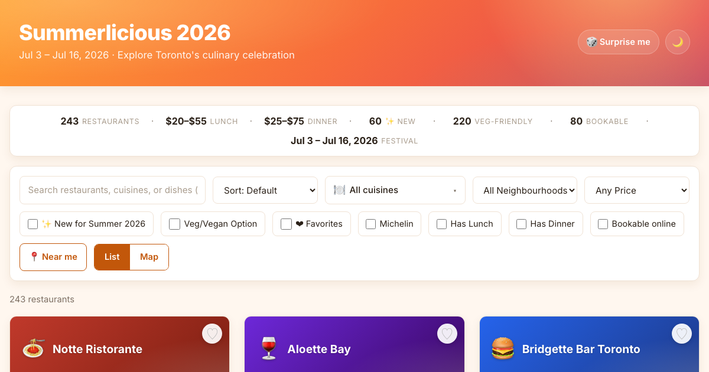

# Winterlicious 2026 Menu Explorer

A fast, filterable, mobile-friendly browser for every restaurant participating in **Toronto's Winterlicious 2026** prix-fixe festival.

Live: **https://asterling.github.io/WinterLicList/**



## Why this exists

The official Winterlicious site is slow, paginated, and hard to filter. This one loads every menu at once and lets you slice the list however you like:

- 🔎 **Search** restaurant names and dishes
- 🍱 **Filter** by cuisine, neighbourhood, lunch/dinner price
- 🌱 **Veg / Vegan only** toggle (only restaurants with qualifying items)
- ⭐ **Michelin** highlight
- ❤️ **Favorites** saved locally
- 🗺️ **Map view** powered by Leaflet + OpenStreetMap
- 🔗 **Deep links** — share any restaurant: `/#r=canoe`
- 📱 **Mobile friendly**

## How it works

- `winterlic.py` — Python scraper hitting Toronto's open-data endpoint. Auto-detects whether the active campaign is Winter- or Summerlicious based on the calendar (override with `LICIOUS_SEASON=Winter|Summer`).
- `menus-latest.json` — the freshest snapshot, always the file the site loads first.
- `menus-{Winterlicious,Summerlicious}-YYYY.json` — per-campaign archives.
- `season.json` — `{season, year, label, fetched_at}`; drives the page title.
- `index.html` / `styles.css` / `app.js` — static frontend, no build step, no framework.

Open `index.html` over `http://` (not `file://`) so the JSON fetch succeeds. The quickest local server:

```bash
python3 -m http.server 8000
# then open http://localhost:8000
```

## Refreshing the data

```bash
python3 -m pip install requests
python3 winterlic.py
```

This rewrites `winterlicious_menus_2026.json` from the city's live endpoint.

A GitHub Action runs this on a schedule — see `.github/workflows/refresh-data.yml`.

## Data source

`https://secure.toronto.ca/c3api_data/v2/DataAccess.svc/Licious/map_data` — City of Toronto open data, no API key required.

## License

MIT. Not affiliated with the City of Toronto or Winterlicious.
